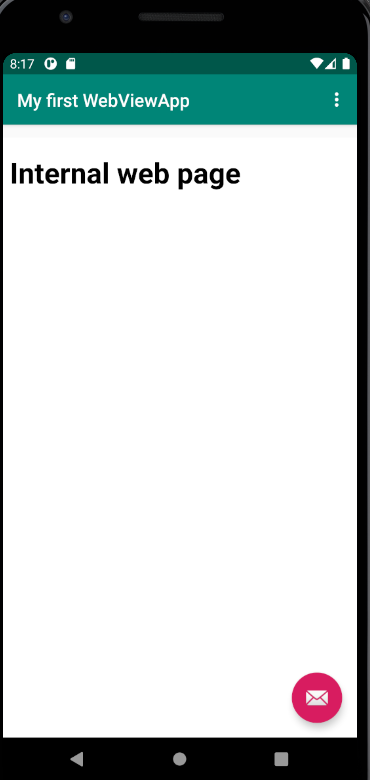

# Rapport dugga2


```
<WebView
        android:id="@+id/my_webview"
        android:layout_width="match_parent"
        android:layout_height="match_parent"
        android:layout_marginTop="70dp"
        />
```
Koden används för att skapa en WebView-element. Id i koden används sedan i java för att ge WeView variablen innehållet.

```
 protected void onCreate(Bundle savedInstanceState) {
       
        myWebView = (WebView) findViewById(R.id.my_webview);

        WebSettings webSettings = myWebView.getSettings();
        webSettings.setJavaScriptEnabled(true);

        WebViewClient MyWebViewClient  = new WebViewClient();
        myWebView.setWebViewClient(MyWebViewClient);
```
Sedan skapas en privalt WebView variabel över koden ovan. Denna variabel fick namnet myWebView. Den fylls sedan med den WebViewen ovan. Alltså det element mend
Id som skapades i xml-dokumentet.
För att sedan aktivera javascript skapas en ny variabel utifrån den tidigare variabeln med datatypen WebSettings. Detta gör det möjligt att använda javascript.
WebViewClient skapas för att köra den externa hemsidan inuti appen. En egen browser skapas inuti appen istället för att den ska öppna en browser som telefonen tycker passar.

```
 public void showExternalWebPage(){
       
        myWebView.loadUrl("https://www.google.se/");
    }

    public void showInternalWebPage(){
        
        myWebView.loadUrl("file:///android_asset/index.html");
    }
```
En asset skapas först och främst. I asseten skapas en html-fil vilket vi kan se att den i koden länkar till i funktionen showInternalWebPage().
När dessa funktioner körs så laddas antingen en extern hemsida i form av google. I den andra funktionen så laddas den interna hemsidan som finns placerad i asseten.
Funktionernas namn indikterar på vilken funktion som ska köras för vilket utfall.


```
public boolean onOptionsItemSelected(MenuItem item) {
       
        int id = item.getItemId();

        //noinspection SimplifiableIfStatement
        if (id == R.id.action_external_web) {
            showExternalWebPage();
            Log.d("==>","Will display external web page");
            return true;
        }

        if (id == R.id.action_internal_web) {
            showInternalWebPage();
            Log.d("==>","Will display internal web page");
            return true;
        }
```
Denna kod hanterar klick i menyn. Vi kan här se att funktionerna i tidigare kodexempel används : ShowInternalWebPage() till exempel. Det innebär att om man klickar på "internal Web page" i
appen, körs den funktionen och således visas den hemsidan. Om man klickar på det andra menyvalet visas den andra hemsidan. If satserna i koden säger att om en knapp klickas på ska detta hända.
Om den andra knappen klickas på så ska en annan funktion köras.

Bilder på hur appen ser ut efter klick på respektive menyval

## Bild på internal webbsida


## Bild på extern webbsida


